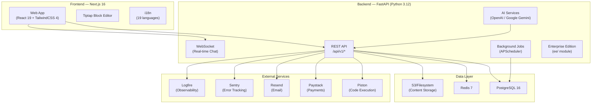
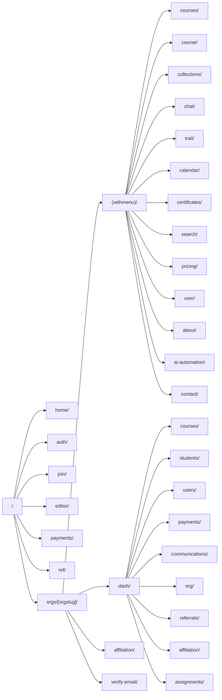

# LearnHouse — Platform Overview

> **Open-source educational platform** for delivering world-class learning experiences with dynamic content, AI-powered features, real-time chat, payments, and multi-organization support.

---

## 1. High-Level Architecture

---

## 2. Repository Structure

| Path                                                                     | Description                                                             |
| ------------------------------------------------------------------------ | ----------------------------------------------------------------------- |
| [apps/api/](file:///c:/Users/hp/Documents/GitHub/learnhouse/apps/api)    | **Backend** — FastAPI Python application                                |
| [apps/web/](file:///c:/Users/hp/Documents/GitHub/learnhouse/apps/web)    | **Frontend** — Next.js 16 React application                             |
| [dev/](file:///c:/Users/hp/Documents/GitHub/learnhouse/dev)              | Docker Compose for local dev services (Postgres, Redis, Piston, SigNoz) |
| [extra/](file:///c:/Users/hp/Documents/GitHub/learnhouse/extra)          | Nginx config and startup scripts                                        |
| [Dockerfile](file:///c:/Users/hp/Documents/GitHub/learnhouse/Dockerfile) | Multi-stage build combining backend + frontend into a single container  |

The repo uses a **pnpm monorepo** with **Turborepo** orchestrating `build`, `dev`, `lint`, and `start` tasks across workspaces.

---

## 3. Backend (FastAPI)

### 3.1 Entry Point & Middleware Stack

[app.py](file:///c:/Users/hp/Documents/GitHub/learnhouse/apps/api/app.py) — Application entry point.

**Middleware chain (order matters):**

1. **Sentry Context** — captures user/org context for error tracking
2. **Custom CORS Headers** — ensures CORS on all responses including errors
3. **Standard CORS** — FastAPI CORS middleware
4. **Logfire** — OpenTelemetry-based observability (opt-in)
5. **GZip** — response compression for payloads > 1KB
6. **Enterprise Middlewares** — dynamically registered from `ee/`

### 3.2 API Routes ([router.py](file:///c:/Users/hp/Documents/GitHub/learnhouse/apps/api/src/router.py))

All routes live under `/api/v1/`. The full route map:

| Prefix             | Module                                                                                                         | Domain                                   |
| ------------------ | -------------------------------------------------------------------------------------------------------------- | ---------------------------------------- |
| `/users`           | [users.py](file:///c:/Users/hp/Documents/GitHub/learnhouse/apps/api/src/routers/users.py)                      | User management                          |
| `/usergroups`      | [usergroups.py](file:///c:/Users/hp/Documents/GitHub/learnhouse/apps/api/src/routers/usergroups.py)            | Group management                         |
| `/auth`            | [auth.py](file:///c:/Users/hp/Documents/GitHub/learnhouse/apps/api/src/routers/auth.py)                        | Authentication (JWT)                     |
| `/orgs`            | [orgs.py](file:///c:/Users/hp/Documents/GitHub/learnhouse/apps/api/src/routers/orgs.py)                        | Organizations (multi-tenant)             |
| `/roles`           | [roles.py](file:///c:/Users/hp/Documents/GitHub/learnhouse/apps/api/src/routers/roles.py)                      | RBAC role management                     |
| `/courses`         | [courses/](file:///c:/Users/hp/Documents/GitHub/learnhouse/apps/api/src/routers/courses)                       | Courses, chapters, activities, schedules |
| `/blocks`          | [blocks.py](file:///c:/Users/hp/Documents/GitHub/learnhouse/apps/api/src/routers/courses/activities)           | Content blocks                           |
| `/chapters`        | chapters                                                                                                       | Course chapters                          |
| `/activities`      | activities                                                                                                     | Learning activities                      |
| `/assignments`     | [assignments](file:///c:/Users/hp/Documents/GitHub/learnhouse/apps/api/src/routers/courses/assignments.py)     | Assignments & grading                    |
| `/certifications`  | certifications                                                                                                 | Certificate generation                   |
| `/collections`     | collections                                                                                                    | Course collections                       |
| `/live_sessions`   | live_sessions                                                                                                  | Live learning sessions                   |
| `/prerequisites`   | prerequisites                                                                                                  | Course prerequisites                     |
| `/trail`           | [trail.py](file:///c:/Users/hp/Documents/GitHub/learnhouse/apps/api/src/routers/trail.py)                      | Learning progress tracking               |
| `/search`          | [search.py](file:///c:/Users/hp/Documents/GitHub/learnhouse/apps/api/src/routers/search.py)                    | Search                                   |
| `/ai`              | [ai/](file:///c:/Users/hp/Documents/GitHub/learnhouse/apps/api/src/routers/ai)                                 | AI features                              |
| `/chat/*`          | [chat/](file:///c:/Users/hp/Documents/GitHub/learnhouse/apps/api/src/routers/chat)                             | Real-time chat (REST + WebSocket)        |
| `/waitlist`        | [waitlist.py](file:///c:/Users/hp/Documents/GitHub/learnhouse/apps/api/src/routers/waitlist.py)                | Waitlist management                      |
| `/communications`  | [communications.py](file:///c:/Users/hp/Documents/GitHub/learnhouse/apps/api/src/routers/communications.py)    | Org communications                       |
| `/referrals`       | [referrals.py](file:///c:/Users/hp/Documents/GitHub/learnhouse/apps/api/ee/routers/referrals.py)               | Referral program (EE)                    |
| `/payments`        | [payments/](file:///c:/Users/hp/Documents/GitHub/learnhouse/apps/api/src/services/payments)                    | Payment processing                       |
| `/webhooks`        | [flutterwave.py](file:///c:/Users/hp/Documents/GitHub/learnhouse/apps/api/src/routers/webhooks/flutterwave.py) | Payment webhooks                         |
| `/code`            | [code.py](file:///c:/Users/hp/Documents/GitHub/learnhouse/apps/api/src/routers/code.py)                        | Code execution                           |
| `/contact`         | [contact.py](file:///c:/Users/hp/Documents/GitHub/learnhouse/apps/api/src/routers/contact.py)                  | Contact form                             |
| `/admin/analytics` | [admin_analytics.py](file:///c:/Users/hp/Documents/GitHub/learnhouse/apps/api/src/routers/admin_analytics.py)  | Admin analytics                          |
| `/health`          | [health.py](file:///c:/Users/hp/Documents/GitHub/learnhouse/apps/api/src/routers/health.py)                    | Health checks                            |
| `/dev`             | [dev.py](file:///c:/Users/hp/Documents/GitHub/learnhouse/apps/api/src/routers/dev.py)                          | Dev-only routes (gated)                  |

### 3.3 Service Layer ([src/services/](file:///c:/Users/hp/Documents/GitHub/learnhouse/apps/api/src/services))

23 service domains including:

| Service            | Key Files                                                                                                                                                                                                                                              | Description                                                            |
| ------------------ | ------------------------------------------------------------------------------------------------------------------------------------------------------------------------------------------------------------------------------------------------------ | ---------------------------------------------------------------------- |
| **Courses**        | [courses.py](file:///c:/Users/hp/Documents/GitHub/learnhouse/apps/api/src/services/courses/courses.py) (37KB)                                                                                                                                          | Full course lifecycle — CRUD, enrollment, publishing                   |
| **Chapters**       | [chapters.py](file:///c:/Users/hp/Documents/GitHub/learnhouse/apps/api/src/services/courses/chapters.py) (19KB)                                                                                                                                        | Chapter ordering, content management                                   |
| **Certifications** | [certifications.py](file:///c:/Users/hp/Documents/GitHub/learnhouse/apps/api/src/services/courses/certifications.py) (21KB)                                                                                                                            | Certificate templates and issuance                                     |
| **Schedules**      | [schedules.py](file:///c:/Users/hp/Documents/GitHub/learnhouse/apps/api/src/services/courses/schedules.py) (22KB)                                                                                                                                      | Course scheduling system                                               |
| **Chat**           | [conversation_service.py](file:///c:/Users/hp/Documents/GitHub/learnhouse/apps/api/src/services/chat/conversation_service.py), [websocket_manager.py](file:///c:/Users/hp/Documents/GitHub/learnhouse/apps/api/src/services/chat/websocket_manager.py) | Real-time messaging with typing indicators, attachments, notifications |
| **Payments**       | [payments_paystack.py](file:///c:/Users/hp/Documents/GitHub/learnhouse/apps/api/src/services/payments/payments_paystack.py) (24KB)                                                                                                                     | Paystack integration, discount codes, product management               |
| **Referrals**      | [referral_commissions.py](file:///c:/Users/hp/Documents/GitHub/learnhouse/apps/api/src/services/referrals/referral_commissions.py), [payouts.py](file:///c:/Users/hp/Documents/GitHub/learnhouse/apps/api/src/services/referrals/payouts.py) (30KB)    | Full referral system with fraud prevention                             |
| **AI**             | [ai.py](file:///c:/Users/hp/Documents/GitHub/learnhouse/apps/api/src/services/ai/ai.py) (10KB)                                                                                                                                                         | OpenAI / Google Gemini integration for content assistance              |
| **Code Execution** | [code_execution.py](file:///c:/Users/hp/Documents/GitHub/learnhouse/apps/api/src/services/code_execution.py)                                                                                                                                           | Sandboxed code execution via Piston engine                             |

### 3.4 Database Layer ([src/db/](file:///c:/Users/hp/Documents/GitHub/learnhouse/apps/api/src/db))

- **ORM**: SQLModel (SQLAlchemy + Pydantic hybrid)
- **Migrations**: Alembic with PostgreSQL enum support
- **Key models**: Users, Organizations, Courses, Chapters, Activities, Blocks, Assignments, Certifications, Roles, User Groups, Collections, Trails, Schedules, Live Sessions, Payments, Referrals, Chat (conversations/messages), Waitlist

### 3.5 Security ([src/security/](file:///c:/Users/hp/Documents/GitHub/learnhouse/apps/api/src/security))

| Component              | File                                                                                                                    | Purpose                                     |
| ---------------------- | ----------------------------------------------------------------------------------------------------------------------- | ------------------------------------------- |
| **Auth**               | [auth.py](file:///c:/Users/hp/Documents/GitHub/learnhouse/apps/api/src/security/auth.py) (9KB)                          | JWT-based authentication (fastapi-jwt-auth) |
| **RBAC**               | [rbac.py](file:///c:/Users/hp/Documents/GitHub/learnhouse/apps/api/src/security/rbac/rbac.py) (10KB)                    | Role-based access control                   |
| **Course Security**    | [courses_security.py](file:///c:/Users/hp/Documents/GitHub/learnhouse/apps/api/src/security/courses_security.py) (19KB) | Course-level permission checks              |
| **Dashboard Security** | [dashboard_security.py](file:///c:/Users/hp/Documents/GitHub/learnhouse/apps/api/src/security/dashboard_security.py)    | Admin dashboard access                      |
| **File Validation**    | [file_validation.py](file:///c:/Users/hp/Documents/GitHub/learnhouse/apps/api/src/security/file_validation.py)          | Upload validation                           |
| **Phone Validation**   | [phone_validation.py](file:///c:/Users/hp/Documents/GitHub/learnhouse/apps/api/src/security/phone_validation.py)        | Phone number validation                     |

### 3.6 Background Jobs ([src/jobs/](file:///c:/Users/hp/Documents/GitHub/learnhouse/apps/api/src/jobs))

Powered by **APScheduler** (AsyncIO), configured at startup:

| Job                    | Schedule                  | Purpose                                     |
| ---------------------- | ------------------------- | ------------------------------------------- |
| Waitlist Activation    | Every 1 min               | Processes pending waitlist entries          |
| Retry Failed Emails    | Every 15 min              | Retries failed waitlist notification emails |
| Commission Eligibility | Daily (configurable hour) | Upgrades pending referral commissions       |
| Payout Processing      | Every 5 min               | Processes referral payout requests          |

### 3.7 Enterprise Edition ([ee/](file:///c:/Users/hp/Documents/GitHub/learnhouse/apps/api/ee))

Conditionally loaded via [ee_hooks.py](file:///c:/Users/hp/Documents/GitHub/learnhouse/apps/api/src/core/ee_hooks.py). Includes:

- **Audit Logs** — full action audit trail
- **Email Domain Management** — domain-based org access control
- **Cloud Internal APIs** — hosted platform management
- **Payment Routes** — additional payment features
- **Referral System** — full referral program (codes, commissions, payouts, fraud prevention)

> [!NOTE]
> The `ee/` directory is stripped from public Docker builds via the `LEARNHOUSE_PUBLIC` build arg.

---

## 4. Frontend (Next.js 16)

### 4.1 Tech Stack

| Technology          | Version | Purpose                    |
| ------------------- | ------- | -------------------------- |
| **Next.js**         | 16.2.6  | Framework (App Router)     |
| **React**           | 19.2.0  | UI library                 |
| **TailwindCSS**     | 4.1.16  | Styling                    |
| **Tiptap**          | 3.10.1  | Block-based content editor |
| **Radix UI**        | Latest  | Accessible UI primitives   |
| **Framer Motion**   | 12.x    | Animations                 |
| **SWR**             | 2.3.6   | Data fetching / caching    |
| **next-auth**       | 4.x     | Authentication             |
| **i18next**         | 25.x    | Internationalization       |
| **Sentry**          | 10.x    | Error monitoring           |
| **react-hook-form** | 7.x     | Form management            |
| **Formik + Yup**    | Latest  | Alternate form handling    |

### 4.2 App Routes ([app/](file:///c:/Users/hp/Documents/GitHub/learnhouse/apps/web/app))

**Key page groups:**

- **Public pages** (`(withmenu)/`) — Course catalog, collections, search, pricing, about, contact, AI pages, chat
- **Dashboard** (`dash/`) — Admin panel for courses, students, users, payments, communications, org settings, referrals, assignments
- **Editor** (`editor/`) — Block-based content editor (Tiptap)
- **Auth** (`auth/`) — Login, registration, password recovery
- **Payments** (`payments/`) — Checkout flows
- **Referrals** (`ref/`) — Referral landing pages

### 4.3 Component Library ([components/](file:///c:/Users/hp/Documents/GitHub/learnhouse/apps/web/components))

| Directory                                                                                       | Purpose                              |
| ----------------------------------------------------------------------------------------------- | ------------------------------------ |
| [Dashboard/](file:///c:/Users/hp/Documents/GitHub/learnhouse/apps/web/components/Dashboard)     | Admin dashboard (menus, pages, misc) |
| [Pages/](file:///c:/Users/hp/Documents/GitHub/learnhouse/apps/web/components/Pages)             | Full page components                 |
| [Objects/](file:///c:/Users/hp/Documents/GitHub/learnhouse/apps/web/components/Objects)         | Reusable domain objects              |
| [Landings/](file:///c:/Users/hp/Documents/GitHub/learnhouse/apps/web/components/Landings)       | Landing page components              |
| [ui/](file:///c:/Users/hp/Documents/GitHub/learnhouse/apps/web/components/ui)                   | Base UI primitives (shadcn-style)    |
| [Contexts/](file:///c:/Users/hp/Documents/GitHub/learnhouse/apps/web/components/Contexts)       | React context providers              |
| [Security/](file:///c:/Users/hp/Documents/GitHub/learnhouse/apps/web/components/Security)       | Auth guards and security wrappers    |
| [Referrals/](file:///c:/Users/hp/Documents/GitHub/learnhouse/apps/web/components/Referrals)     | Referral UI components               |
| [Affiliation/](file:///c:/Users/hp/Documents/GitHub/learnhouse/apps/web/components/Affiliation) | Affiliate program UI                 |

### 4.4 Frontend Services ([services/](file:///c:/Users/hp/Documents/GitHub/learnhouse/apps/web/services))

19 service modules mirroring backend domains: `ai`, `auth`, `blocks`, `courses`, `payments`, `referral`, `waitlist`, `organizations`, `users`, `roles`, `search`, `settings`, `usergroups`, `dashboard`, `media`, `ee`, `config`, `contact`, `communications`.

### 4.5 Internationalization

**19 supported languages**: Arabic, Bengali, Chinese, Dutch, English, French, German, Hindi, Indonesian, Italian, Japanese, Korean, Polish, Portuguese, Russian, Spanish, Thai, Turkish, Vietnamese.

Locale files: [locales/](file:///c:/Users/hp/Documents/GitHub/learnhouse/apps/web/locales)

---

## 5. Configuration System

Configuration follows a **YAML + Environment Variable** layering pattern defined in [config.py](file:///c:/Users/hp/Documents/GitHub/learnhouse/apps/api/config/config.py):

| Config Area   | Key Env Variables                                                                                                 | Purpose                        |
| ------------- | ----------------------------------------------------------------------------------------------------------------- | ------------------------------ |
| **General**   | `LEARNHOUSE_DEVELOPMENT_MODE`, `LEARNHOUSE_LOGFIRE_ENABLED`, `LEARNHOUSE_SENTRY_ENABLED`                          | Runtime mode                   |
| **Hosting**   | `LEARNHOUSE_DOMAIN`, `LEARNHOUSE_PORT`, `LEARNHOUSE_SSL`, `LEARNHOUSE_ALLOWED_ORIGINS`, `LEARNHOUSE_APP_BASE_URL` | Network / CORS                 |
| **Database**  | `LEARNHOUSE_SQL_CONNECTION_STRING`                                                                                | PostgreSQL connection          |
| **Redis**     | `LEARNHOUSE_REDIS_CONNECTION_STRING`                                                                              | Redis connection               |
| **Security**  | `LEARNHOUSE_AUTH_JWT_SECRET_KEY`                                                                                  | JWT signing                    |
| **AI**        | `LEARNHOUSE_OPENAI_API_KEY`, `LEARNHOUSE_IS_AI_ENABLED`                                                           | AI features                    |
| **Email**     | `LEARNHOUSE_RESEND_API_KEY`, `LEARNHOUSE_SYSTEM_EMAIL_ADDRESS`                                                    | Transactional email via Resend |
| **Payments**  | `LEARNHOUSE_PAYSTACK_SECRET_KEY`, `LEARNHOUSE_PAYSTACK_PUBLIC_KEY`                                                | Paystack gateway               |
| **Content**   | `LEARNHOUSE_CONTENT_DELIVERY_TYPE`, `LEARNHOUSE_S3_API_BUCKET_NAME`                                               | Filesystem or S3 storage       |
| **Multi-org** | `LEARNHOUSE_USE_DEFAULT_ORG`, `LEARNHOUSE_SELF_HOSTED`                                                            | Organization mode              |

---

## 6. Infrastructure & DevOps

### 6.1 Local Development

[docker-compose.yml](file:///c:/Users/hp/Documents/GitHub/learnhouse/dev/docker-compose.yml) provides:

- **PostgreSQL 16** (port 5435)
- **Redis 7** (port 6379)
- **Piston** code execution engine (port 2000)
- **SigNoz** observability (optional profile)

### 6.2 Production Deployment

The root [Dockerfile](file:///c:/Users/hp/Documents/GitHub/learnhouse/Dockerfile) is a multi-stage build:

1. **Frontend deps** → `pnpm install`
2. **Frontend build** → `next build` (standalone output)
3. **Backend** → `uv sync` (Python deps)
4. **Runner** → Nginx reverse proxy + PM2 (Node) + Uvicorn (Python)

Exposes ports **80** (Nginx), **9000** (API).

### 6.3 Observability & Monitoring

| Tool                      | Purpose                                              |
| ------------------------- | ---------------------------------------------------- |
| **Sentry**                | Error tracking (both frontend and backend)           |
| **Logfire**               | OpenTelemetry instrumentation (FastAPI + SQLAlchemy) |
| **SigNoz**                | Distributed tracing (optional)                       |
| **APScheduler heartbeat** | Background job health monitoring                     |

---

## 7. Key Feature Domains

### 🎓 Learning Management

- **Courses** with chapters, activities, and block-based content (Tiptap editor)
- **Prerequisites** system for course dependencies
- **Schedules** with calendar integration
- **Live Sessions** for real-time learning
- **Assignments** with grading
- **Certifications** — templated, auto-generated on completion
- **Course Collections** for grouping content
- **Course Updates** feed

### 🤖 AI Integration

- Teacher and student **copilot** powered by OpenAI and Google Gemini
- Content assistance for course creation
- AI automation pages on the frontend

### 💬 Real-Time Chat

- WebSocket-based messaging with REST fallback
- Conversations, messages, attachments
- Typing indicators and notifications
- Admin moderation panel

### 💳 Payments

- **Paystack** integration (primary gateway)
- **Flutterwave** webhook support
- Discount codes system (27KB of logic)
- Product management and customer tracking
- Course access control tied to purchases

### 🔗 Referral Program

- Referral code generation and tracking
- Commission calculation with eligibility periods
- Payout processing (automated via background jobs)
- **Fraud prevention** system (19KB of detection logic)

### 👥 Multi-Organization

- Slug-based org routing (`/orgs/[orgslug]/`)
- Per-org configuration, branding, and settings
- RBAC with org-scoped roles
- User groups within organizations

### 📊 Admin Dashboard

- Course management
- Student enrollment tracking
- User management
- Payment analytics
- Communication tools
- Organization settings
- Referral program management

### 📧 Communications

- Waitlist management with automated activation
- Email via Resend
- Contact form

### 🔒 Security

- JWT-based authentication
- RBAC with fine-grained permissions
- Course-level access control (19KB of security logic)
- File upload validation
- Phone number validation

---

## 8. Technology Summary

| Layer                  | Technology                                       |
| ---------------------- | ------------------------------------------------ |
| **Frontend Framework** | Next.js 16 (App Router, Turbopack dev)           |
| **UI**                 | React 19, TailwindCSS 4, Radix UI, Framer Motion |
| **Content Editor**     | Tiptap 3 (ProseMirror-based)                     |
| **Backend Framework**  | FastAPI (Python 3.12)                            |
| **ORM**                | SQLModel (SQLAlchemy + Pydantic)                 |
| **Database**           | PostgreSQL 16                                    |
| **Cache**              | Redis 7                                          |
| **Migrations**         | Alembic                                          |
| **Auth**               | JWT (fastapi-jwt-auth) + next-auth               |
| **Payments**           | Paystack, Flutterwave                            |
| **Email**              | Resend                                           |
| **AI**                 | OpenAI, Google Generative AI                     |
| **Code Execution**     | Piston (sandboxed)                               |
| **Background Jobs**    | APScheduler                                      |
| **Observability**      | Sentry, Logfire (OpenTelemetry), SigNoz          |
| **Package Management** | pnpm (frontend), uv (backend)                    |
| **Monorepo**           | Turborepo                                        |
| **Deployment**         | Docker (multi-stage), Nginx, PM2                 |
